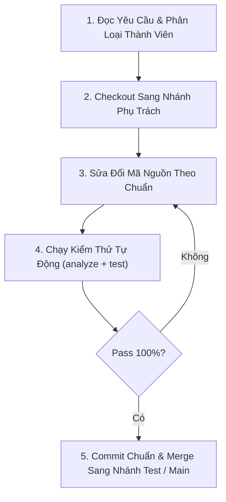

# AI AGENT OPERATIONAL SKILL & GUIDELINES
**Quy tắc vận hành chuẩn dành cho AI Agent khi phát triển và bảo trì dự án SmartStock Admin**

> File này định nghĩa hành vi, quy tắc kiểm tra, phân luồng nhiệm vụ và tiêu chuẩn code để bất kỳ AI Agent nào (Antigravity, Gemini, Claude, Copilot, v.v.) khi đọc vào dự án này đều tự động làm việc một cách chính xác nhất mà không vi phạm kiến trúc hoặc nhầm lẫn trách nhiệm giữa các thành viên.

---

## 1. NGUYÊN TẮC NHẬN DIỆN VAI TRÒ (PERSONA & TASK ROUTING)

Khi nhận yêu cầu từ người dùng, AI Agent **PHẢI** đối chiếu với file `PHAN_CONG_NHIEM_VU.md` và tuân thủ định tuyến sau:

| Nếu Yêu Cầu Liên Quan Đến... | Thành Viên Phụ Trách | Nhánh Git Làm Việc | Module Mã Nguồn Tương Ứng |
| :--- | :--- | :--- | :--- |
| **Kiến trúc lõi, Riverpod, CSDL Hive, Dashboard Analytics, Thẻ KPI, Biểu đồ `fl_chart` (Pareto, ITR, Holding Cost, Donut)** | **Hoàng Nhật** | `HoangNhat` | `lib/core/storage/`, `lib/core/providers/`, `lib/features/dashboard_analytics/`, `lib/features/home/` |
| **Nhập kho (Stock In), Công thức giá vốn MAC, Xuất kho (Stock Out), Điều chuyển chi nhánh, Camera Barcode Scanner** | **Trung Lương** | `TrungLuong` | `lib/features/operations_stock_in/`, `lib/features/operations_stock_out/`, `lib/features/scanner/` |
| **Kiểm kê định kỳ (Cycle Counting), Đối soát chênh lệch, Cảnh báo tồn an toàn & FEFO, In PDF & Xuất Excel, Viết Unit Test** | **Quang Minh** | `QuangMinh` | `lib/features/cycle_counting/`, `lib/features/reports_export/`, `lib/core/services/`, `test/` |

---

## 2. QUY TRÌNH THAO TÁC CỦA AI AGENT (STEP-BY-STEP PROTOCOL)

Mỗi khi AI Agent thực hiện một nhiệm vụ trong dự án, **BẮT BUỘC** làm theo 5 bước sau:



1. **Bước 1: Xác định ngữ cảnh:** Đọc kỹ yêu cầu người dùng, xác định xem thuộc phạm vi của ai (`HoangNhat`, `TrungLuong`, hay `QuangMinh`).
2. **Bước 2: Kiểm tra nhánh Git:** Chuyển sang đúng nhánh trước khi chỉnh sửa code:
   ```bash
   git checkout <Tên_Nhánh_Phụ_Trách>
   ```
3. **Bước 3: Viết mã nguồn đúng chuẩn:** Tuân thủ Clean Code và không phá vỡ các module khác.
4. **Bước 4: Kiểm tra nghiêm ngặt:** Chạy 2 lệnh kiểm tra:
   - `flutter analyze` (Bắt buộc 0 warning, 0 error).
   - `flutter test` (Bắt buộc tất cả test cases đều PASS).
5. **Bước 5: Đồng bộ & Merge:** Commit theo định dạng chuẩn và merge vào nhánh `test` để kiểm thử tích hợp trước khi vào `main`.

---

## 3. CÁC TIÊU CHUẨN KỸ THUẬT BẮT BUỘC (GOLDEN CODING RULES)

### A. Quy ước State Management (Riverpod 3.x)
- **KHÔNG ĐƯỢC** sử dụng `StateNotifierProvider` cũ hay `ChangeNotifier`.
- **BẮT BUỘC** sử dụng `Notifier` và `NotifierProvider` theo mẫu chuẩn:
  ```dart
  class ProductListNotifier extends Notifier<List<ProductSKU>> {
    @override
    List<ProductSKU> build() {
      return ref.watch(storageServiceProvider).getAllProducts();
    }
    // Các hàm nghiệp vụ...
  }
  final productListProvider = NotifierProvider<ProductListNotifier, List<ProductSKU>>(ProductListNotifier.new);
  ```

### B. Quy ước Tính toán Quản trị Kho (Inventory Math)
- Tất cả công thức toán học phải được đặt trong `lib/core/utils/inventory_math.dart`:
  - **MAC (Moving Average Cost):** Bắt buộc xử lý trường hợp chia cho 0 khi tổng số lượng = 0.
  - **ITR (Inventory Turnover Ratio):** Bắt buộc xử lý tồn kho bình quân = 0.
  - **Pareto ABC:** Nhóm A (<= 80%), Nhóm B (80% - 95%), Nhóm C (> 95%).
  - **Chênh lệch kiểm kê:** `Variance = PhysicalCount - BookStock`.

### C. Quy ước Lưu trữ Offline (Hive Persistence)
- Mọi thao tác thêm/sửa/xóa hàng hóa hoặc đơn nhập/xuất **BẮT BUỘC** gọi qua `HiveStorageService.instance`.
- Sau khi ghi vào Hive, phải kích hoạt `ref.read(provider.notifier).refresh()` để UI cập nhật tự động theo thời gian thực.

### D. Quy ước Quét Mã Vạch (Barcode & Hardware)
- Khi viết hoặc sửa giao diện quét barcode, luôn giữ lại **chế độ nhập tay (Manual fallback)** và **chip mã mẫu** trong `BarcodeScannerSheet` để việc test trên Web/Desktop hoặc CI/CD không bị treo camera.

### E. Quy ước In ấn & Báo cáo
- Font chữ tiếng Việt trong file PDF **BẮT BUỘC** dùng font Unicode qua `PdfGoogleFonts.robotoRegular()` và `PdfGoogleFonts.robotoBold()`.
- Tuyệt đối không dùng font mặc định Helvetica vì sẽ bị lỗi dấu tiếng Việt (mất ký tự, dấu ?).

---

## 4. QUY ƯỚC ĐẶT TÊN COMMIT (CONVENTIONAL COMMITS)
AI Agent phải commit theo mẫu:
- `feat(analytics): thêm biểu đồ Pareto ABC theo yêu cầu của Hoàng Nhật`
- `feat(operations): tối ưu luồng nhập kho và tính MAC của Trung Lương`
- `feat(audit): bổ sung xuất báo cáo kiểm kê Excel của Quang Minh`
- `fix(scanner): khắc phục lỗi đóng camera khi quét liên tục`
- `test(core): bổ sung unit test cho công thức ITR và MAC`

---

## 5. TỔNG KẾT VÀ TÍNH TỰ ĐỘNG
Bằng cách tham chiếu đồng thời file này (`AI_AGENT_SKILL.md`) và file `PHAN_CONG_NHIEM_VU.md`, AI Agent có thể độc lập:
- Tiếp nhận task từ bất kỳ ai trong 3 thành viên.
- Chuyển đúng nhánh git tương ứng.
- Viết code không bị xung đột (conflict).
- Tự động chạy test để bảo đảm hệ thống luôn sẵn sàng triển khai trên nhánh `production`.
